# AI Discovery Cards Persona Bot - Architecture Documentation

## Overview

The AI Discovery Cards Persona Bot is a secure, cloud-native application built on Azure that enables interactive conversations with AI-powered customer personas. The architecture implements enterprise-grade security, scalability, and monitoring capabilities while maintaining simplicity and ease of deployment.

## System Architecture

### High-Level Architecture

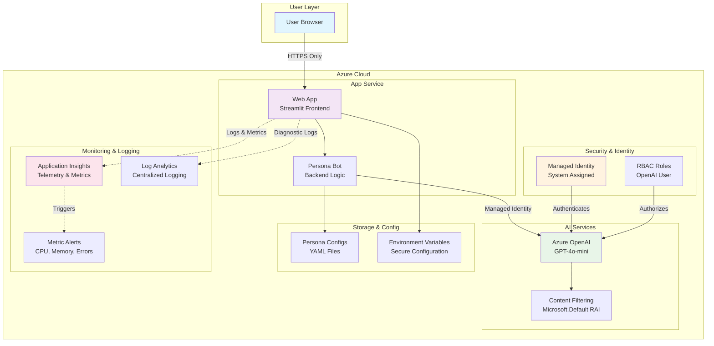

### Component Architecture

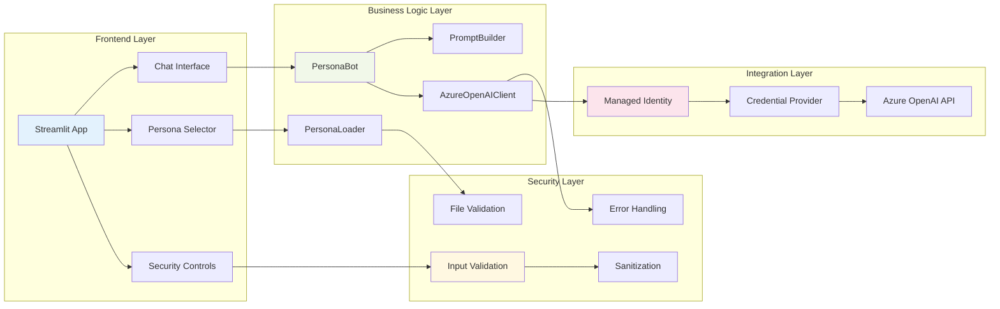

## Data Flow Architecture

### User Interaction Flow

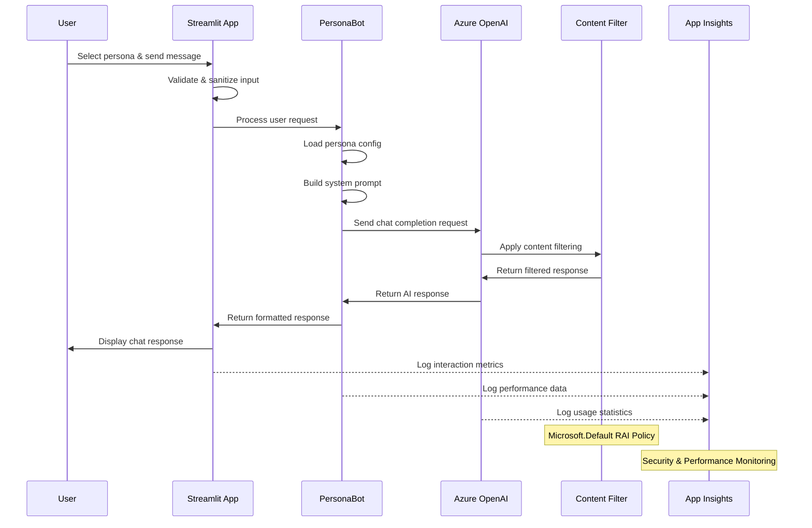

### Authentication Flow

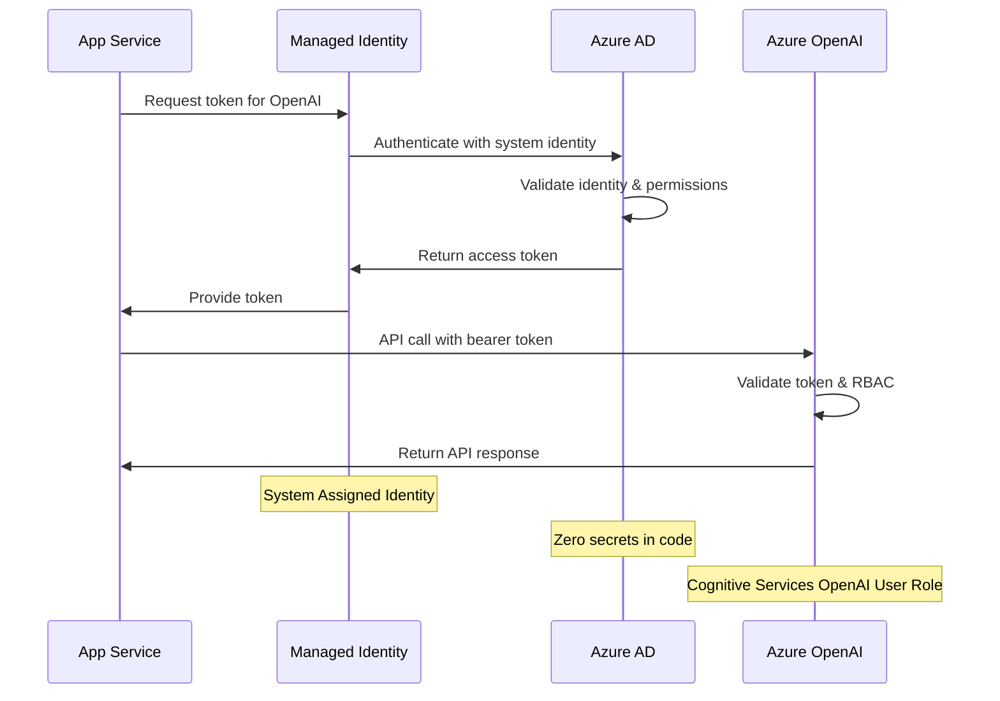

## Security Architecture

### Security Layers

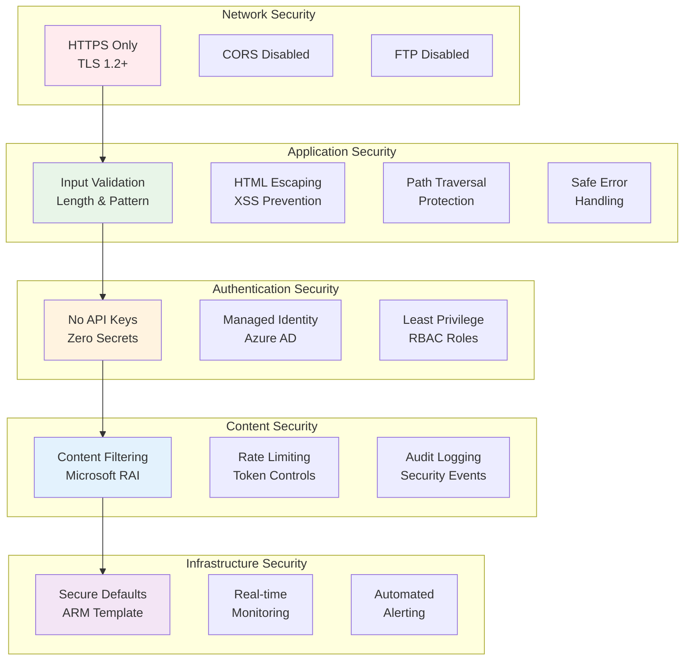

### Security Controls Matrix

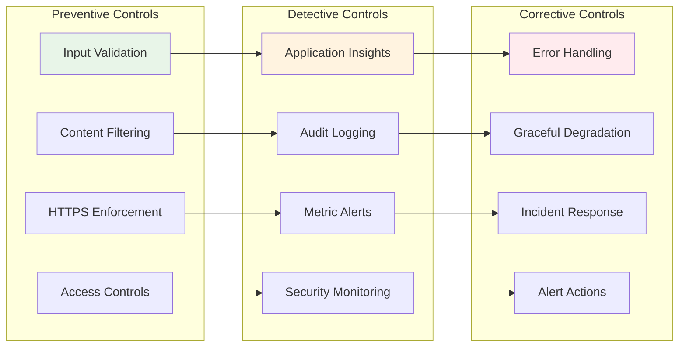

## Deployment Architecture

### Infrastructure Components

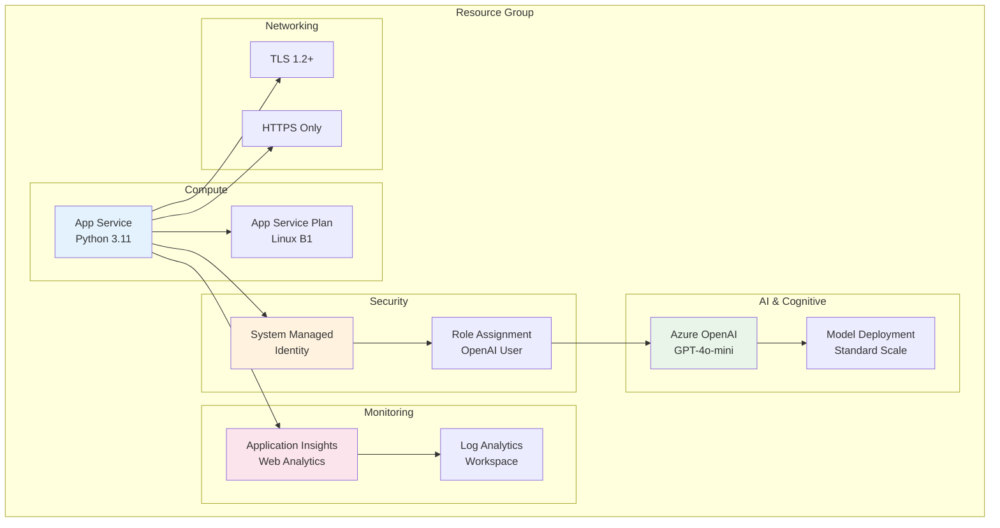

### Deployment Pipeline

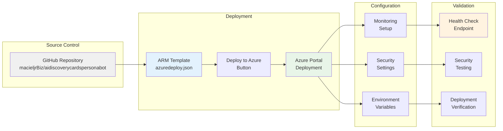

## Technology Stack

### Frontend Stack

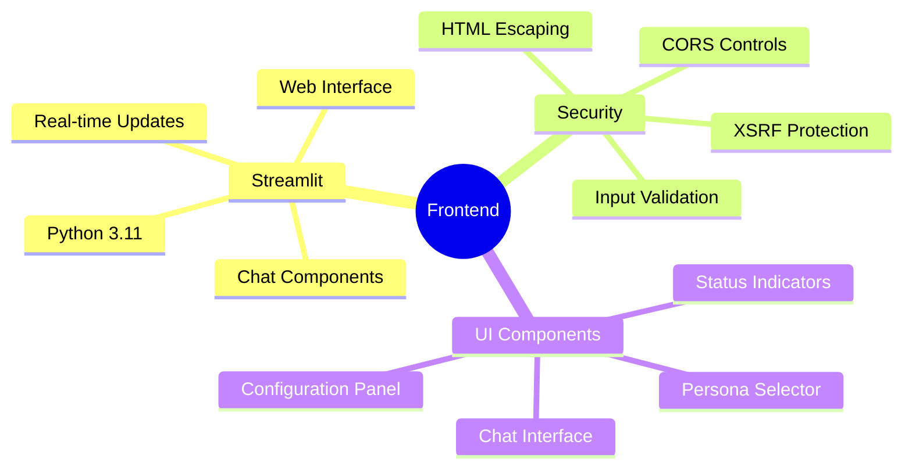

### Backend Stack

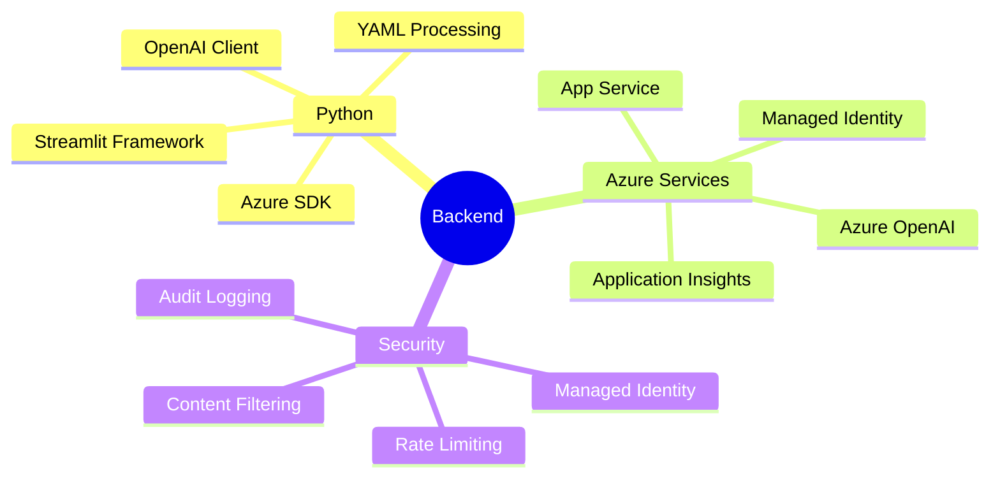

## Data Architecture

### Data Flow Patterns

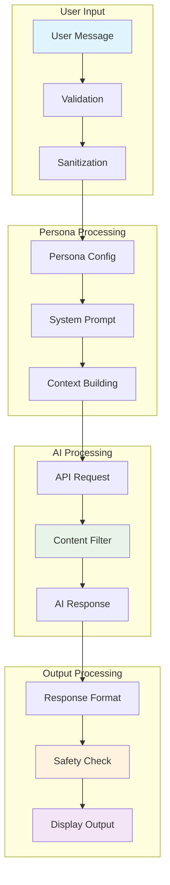

### Configuration Management

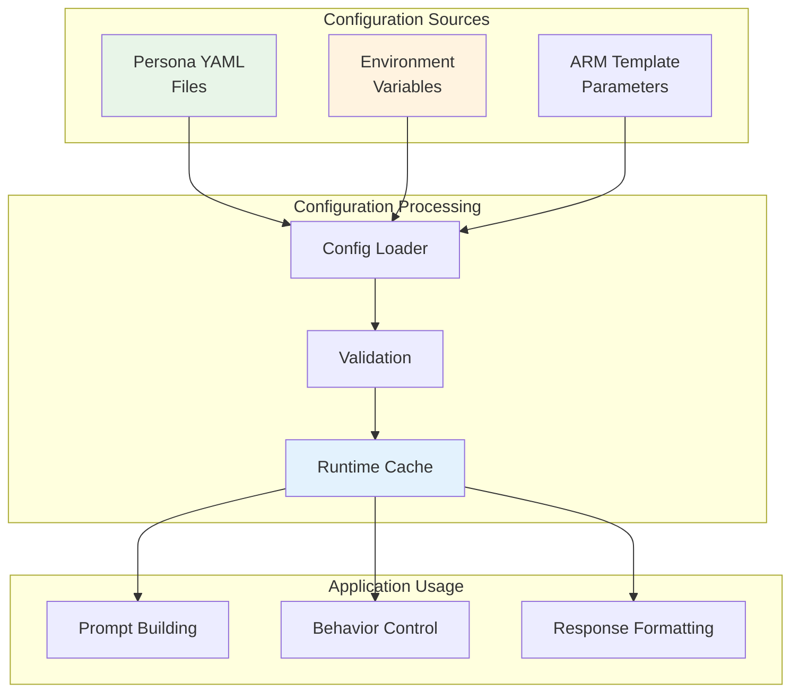

## Monitoring Architecture

### Observability Stack

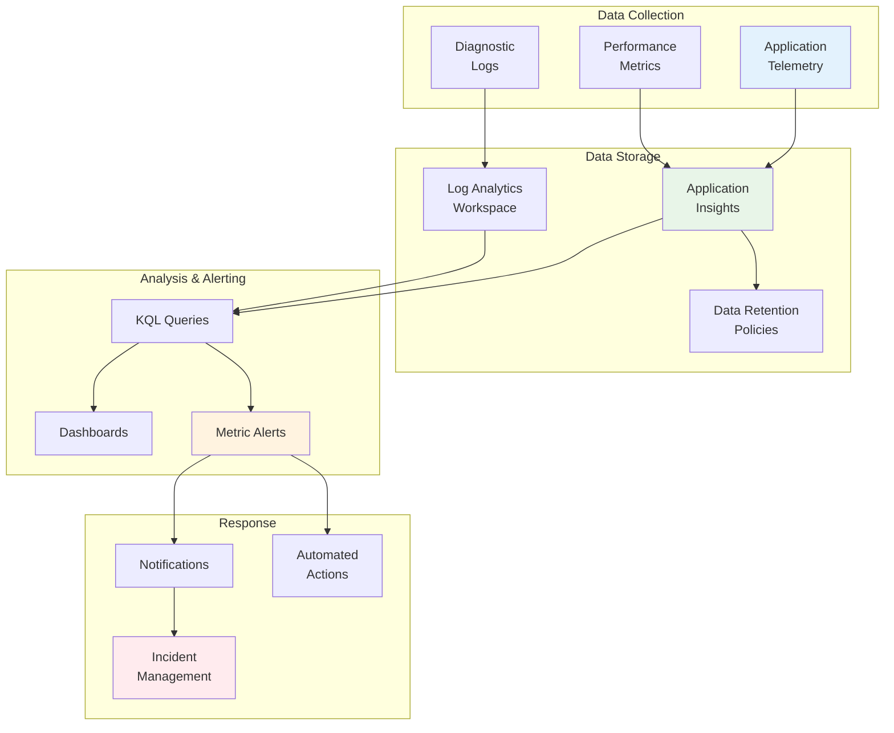

### Alert Configuration

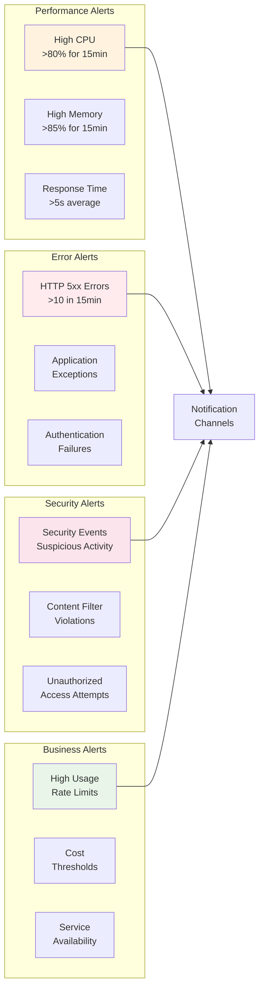

## Performance Architecture

### Scalability Considerations

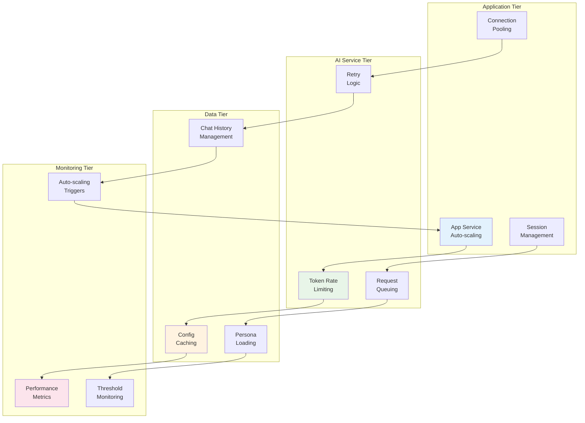

## API Architecture

### API Design Patterns

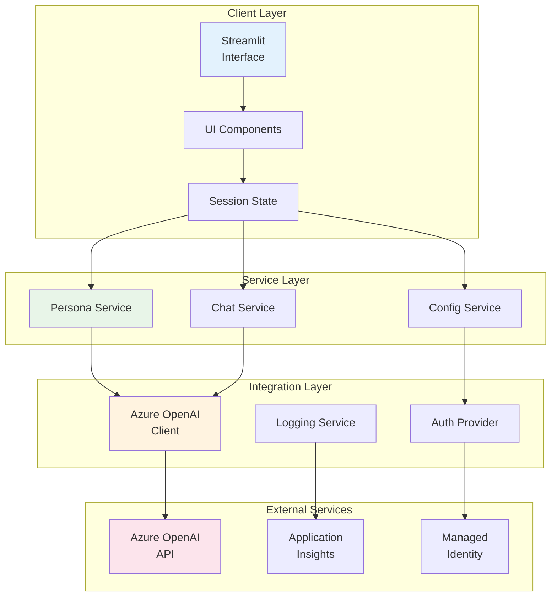

## Disaster Recovery Architecture

### Backup and Recovery Strategy

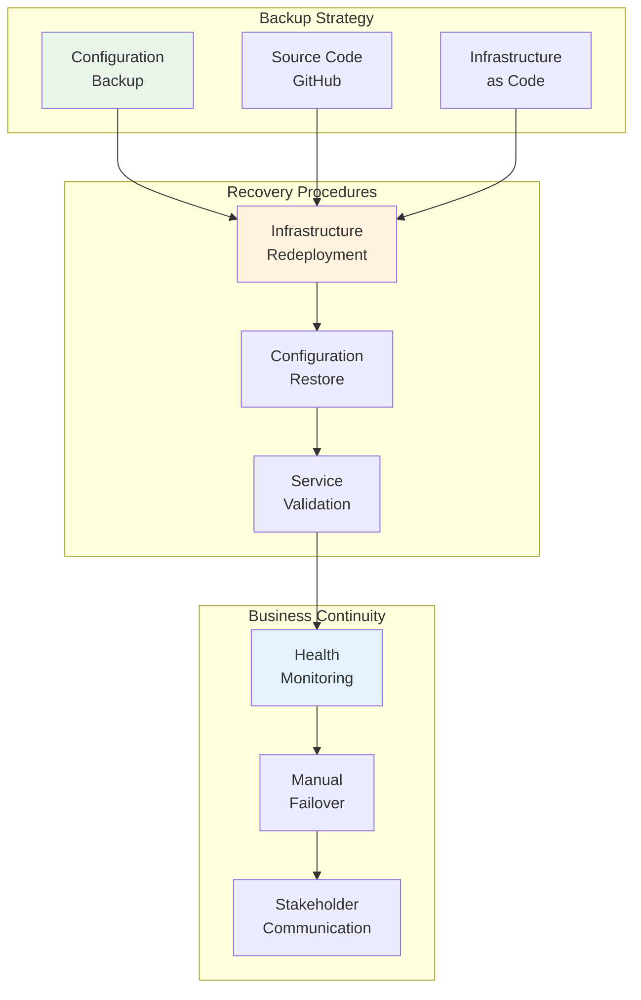

## Conclusion

This architecture provides a robust, secure, and scalable foundation for the AI Discovery Cards Persona Bot. The design emphasizes:

1. **Security First**: Zero-trust authentication with comprehensive security controls
2. **Cloud Native**: Leverages Azure PaaS services for scalability and reliability
3. **Observability**: Comprehensive monitoring and alerting capabilities
4. **Maintainability**: Clear separation of concerns and documented interfaces
5. **Compliance**: Enterprise-grade security and governance controls

The modular architecture allows for easy extension and modification while maintaining security and performance standards. The extensive use of Azure managed services reduces operational overhead while providing enterprise-grade capabilities.

---

*This architecture documentation should be reviewed and updated as the system evolves and new requirements emerge.*